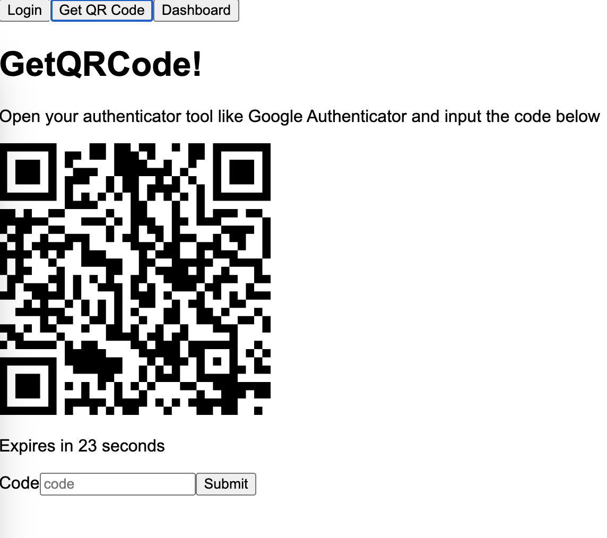

# TOTP based logins

- Run the `client` and `server` separately
- For both the start command is
```
$ npm run dev
```
- Have a tool like google authenticator ready!

- Visit: http://localhost:5173/




## Credits

- https://github.com/wuyanxin/totp.js/tree/master
